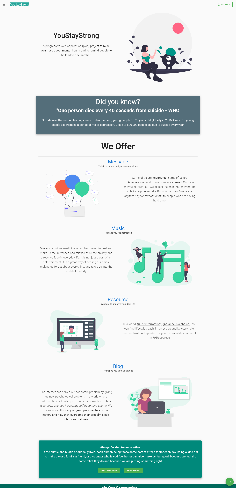
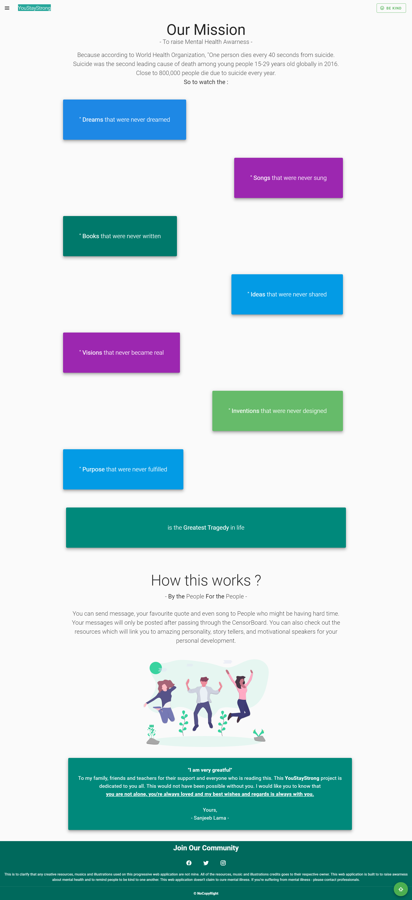
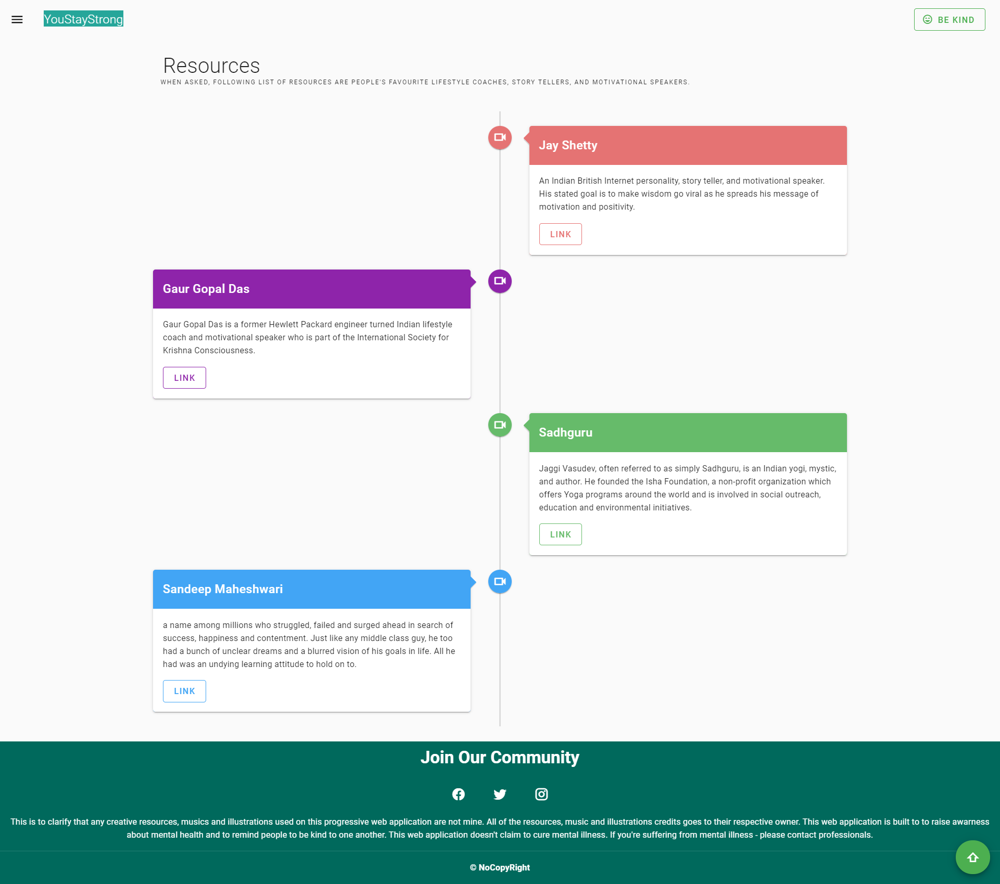
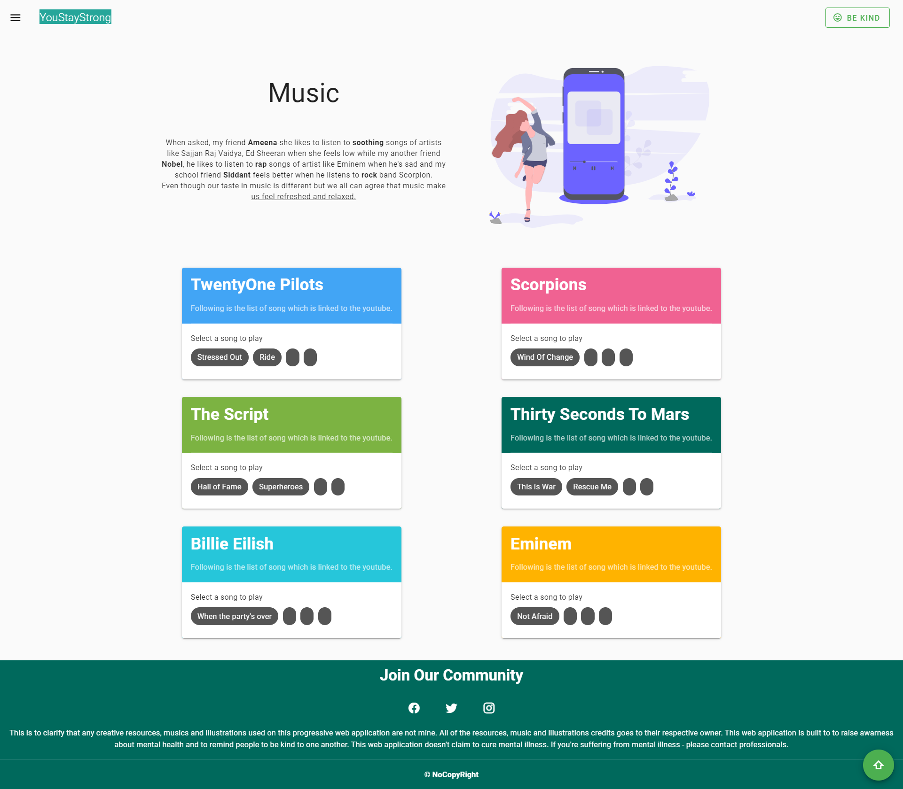
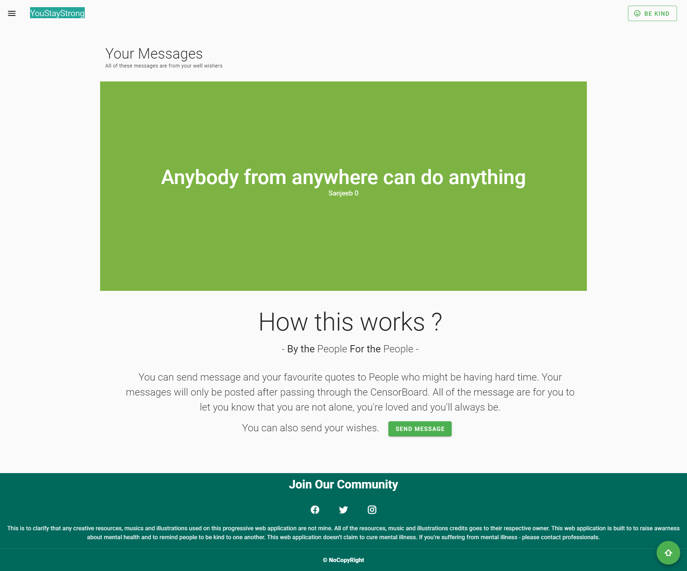

#YouStayStrong

- To raise Mental Health Awarness - Because according to World Health Organization, "One person dies every 40 seconds
  from suicide.
  Suicide was the second leading cause of death among
  young people 15-29 years old globally in 2016.
  Close to 800,000 people die due to suicide every year.
# Preview:
###### Index Page

###### About Page

###### Resources Page

###### Music Page

###### Message Page

###### Menu Page


## Project setup

```
npm install
```

### Compiles and hot-reloads for development

```
npm run serve
```

### Compiles and minifies for production

```
npm run build
```

### Lints and fixes files

```
npm run lint
```

### Customize configuration

See [Configuration Reference](https://cli.vuejs.org/config/).
